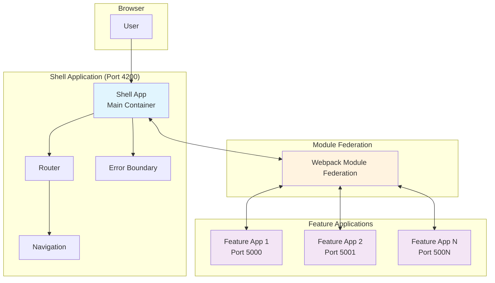
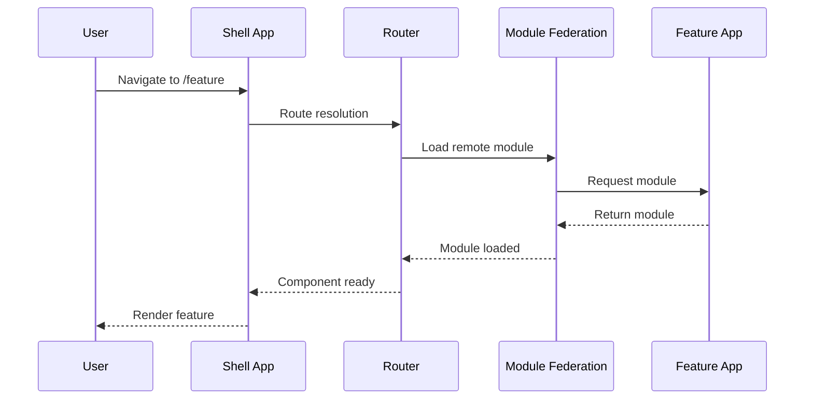
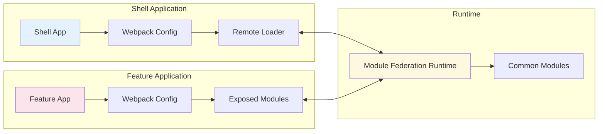
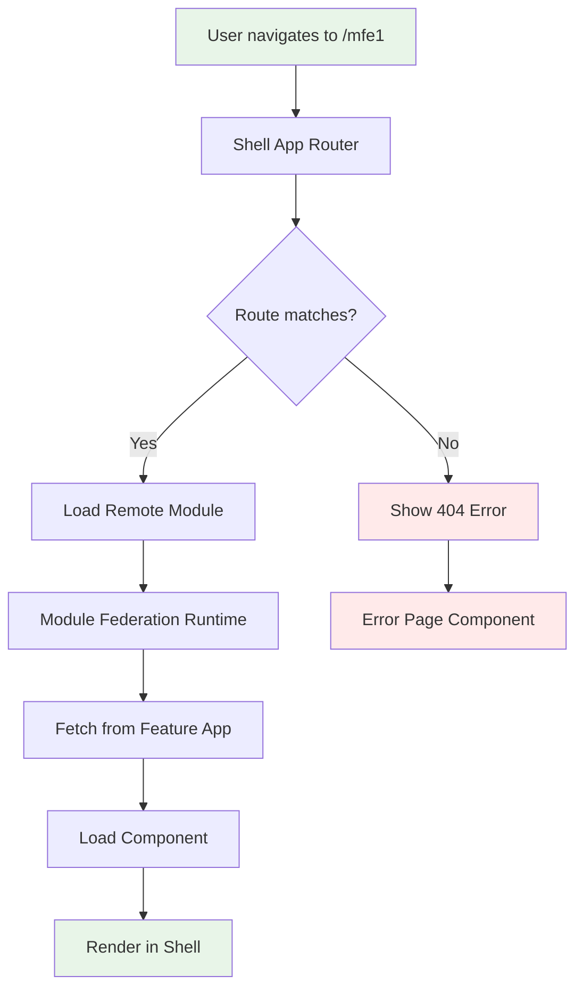
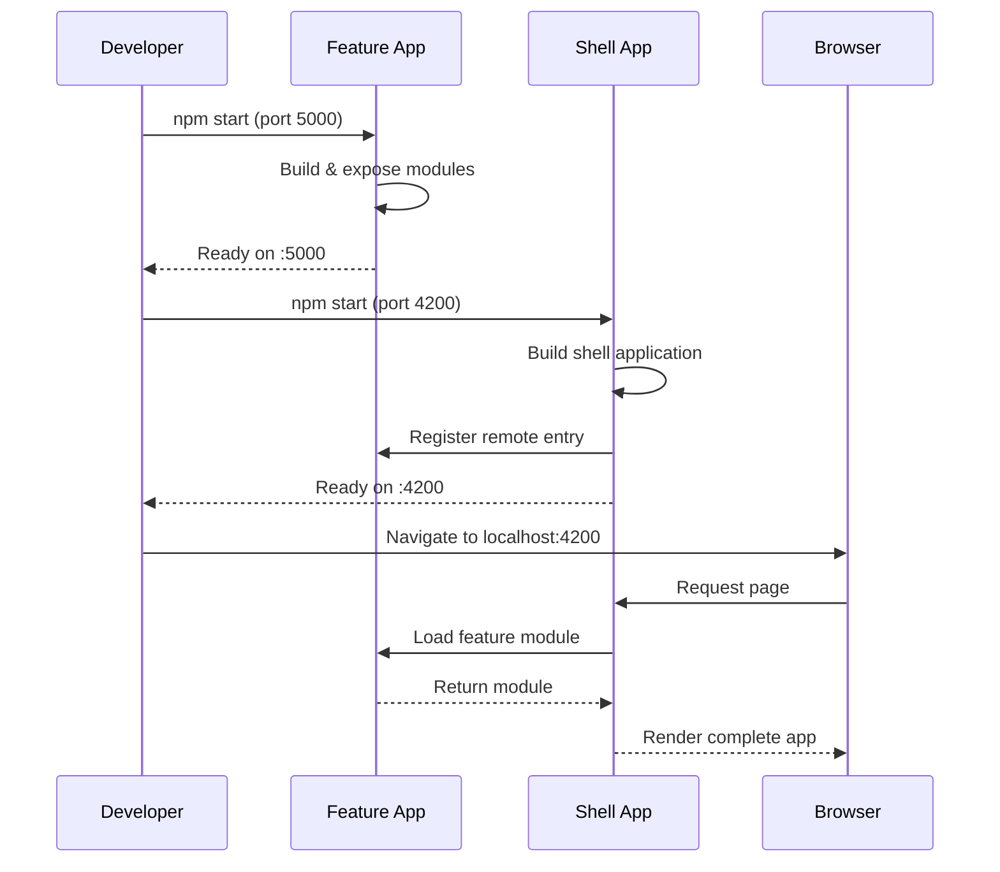

# Angular Micro-Frontend Template with Module Federation

A complete, production-ready Angular micro-frontend architecture template using Module Federation. Perfect for building scalable, distributed web applications.


## Table of Contents

- [Overview](#overview)
- [Architecture](#architecture)
- [Quick Start](#quick-start)
- [Project Structure](#project-structure)
- [How It Works](#how-it-works)
- [Development Guide](#development-guide)
- [Configuration](#configuration)
- [Deployment](#deployment)
- [FAQ & Troubleshooting](#faq--troubleshooting)
- [Contributing](#contributing)

## Overview

This template demonstrates a modern micro-frontend architecture where:

- **Shell Application** acts as the main container and orchestrator
- **Feature Applications** are independent micro-frontends that can be developed and deployed separately
- **Module Federation** enables runtime integration and code sharing

### Key Benefits

- **Independent Development** - Teams can work on different parts simultaneously
- **Independent Deployment** - Deploy micro-frontends separately
- **Technology Agnostic** - Mix different frameworks and versions
- **Scalable Architecture** - Add new micro-frontends easily
- **Code Sharing** - Share common libraries and components

## Architecture

### High-Level Architecture Diagram



### Component Interaction Flow



### Module Federation Architecture



## Quick Start

### Prerequisites

- Node.js 14.x or higher
- npm 6.x or higher
- Git

### Automated Setup (Recommended)

```bash
# Clone the repository
git clone https://github.com/[your-username]/[your-repo-name].git
cd [your-repo-name]

# Run automated setup
chmod +x setup.sh
./setup.sh

# Install dependencies and start
npm run install:all
npm start
```

### Manual Setup

```bash
# 1. Clone and navigate
git clone https://github.com/[your-username]/[your-repo-name].git
cd [your-repo-name]

# 2. Install dependencies for both applications
cd shell-app && npm install && cd ..
cd feature1-app && npm install && cd ..

# 3. Start applications (requires 2 terminals)
# Terminal 1: Feature app
cd feature1-app && npm start

# Terminal 2: Shell app
cd shell-app && npm start
```

### Access Applications

- **Shell App**: http://localhost:4200
- **Feature App**: http://localhost:5000

## 📁 Project Structure

```
[your-repo-name]/
├── 📁 shell-app/                    # Main container application
│   ├── 📁 src/
│   │   ├── 📁 app/
│   │   │   ├── app-routing.module.ts    # Main routing with micro-frontend routes
│   │   │   ├── app.component.ts         # Shell application component
│   │   │   └── 📁 error-page/           # Error handling components
│   │   ├── 📁 environments/             # Environment configurations
│   │   ├── bootstrap.ts                 # Module Federation bootstrap
│   │   └── main.ts                      # Application bootstrap
│   ├── webpack.config.js                # Module Federation configuration
│   ├── webpack.prod.config.js           # Production configuration
│   └── package.json                     # Dependencies and scripts
│
├── 📁 feature1-app/                 # Micro-frontend application
│   ├── 📁 src/
│   │   ├── 📁 app/
│   │   │   ├── 📁 mfe1/                 # Main feature module
│   │   │   ├── app.module.ts            # Feature app module
│   │   │   └── app-routing.module.ts    # Feature routing
│   │   ├── 📁 environments/             # Environment configurations
│   │   ├── bootstrap.ts                 # Module Federation bootstrap
│   │   └── main.ts                      # Dynamic import for MF
│   ├── webpack.config.js                # Module Federation configuration
│   ├── webpack.prod.config.js           # Production configuration
│   └── package.json                     # Dependencies and scripts
│
├── 📁 .github/                      # GitHub Actions & templates
│   ├── 📁 workflows/
│   │   └── ci.yml                       # Continuous Integration pipeline
│   ├── 📁 ISSUE_TEMPLATE/               # Issue templates
│   └── pull_request_template.md         # PR template
│
├── 📁 .vscode/                      # VS Code workspace configuration
│   └── angular-microfrontend-template.code-workspace
│
├── setup.sh                         # Automated setup script
├── package.json                     # Root package management
├── .gitignore                       # Git ignore patterns
└── README.md                        # This file
```

##  How It Works

### 1. Module Federation Configuration

#### Shell App (Consumer)

```javascript
// shell-app/webpack.config.js
const ModuleFederationPlugin = require("@angular-architects/module-federation/webpack");

module.exports = {
  plugins: [
    new ModuleFederationPlugin({
      remotes: {
        mfe1: "http://localhost:5000/remoteEntry.js",
      },
    }),
  ],
};
```

#### Feature App (Producer)

```javascript
// feature1-app/webpack.config.js
const ModuleFederationPlugin = require("@angular-architects/module-federation/webpack");

module.exports = {
  plugins: [
    new ModuleFederationPlugin({
      name: "mfe1",
      exposes: {
        "./Module": "./src/app/mfe1/mfe1.module.ts",
      },
    }),
  ],
};
```

### 2. Dynamic Loading Process



### 3. Startup Sequence



##  Development Guide

### Available NPM Scripts

#### Root Level Scripts

```bash
npm run install:all      # Install dependencies for all apps
npm start               # Start both shell and feature apps
npm run build           # Build all applications
npm run build:prod      # Production build for all apps
npm test               # Run tests for all apps
npm run lint           # Lint all applications
npm run clean          # Clean all node_modules and build artifacts
```

#### Individual App Scripts

```bash
# Shell app
npm run start:shell     # Start shell app only
npm run build:shell     # Build shell app only
npm run test:shell      # Test shell app only

# Feature app
npm run start:feature   # Start feature app only
npm run build:feature   # Build feature app only
npm run test:feature    # Test feature app only
```

### Adding a New Micro-Frontend

1. **Create New Angular App**

```bash
ng new my-feature-app --routing --style=scss
cd my-feature-app
npm install @angular-architects/module-federation
```

2. **Configure Module Federation**

```bash
ng add @angular-architects/module-federation --project my-feature-app --type remote --port 5001
```

3. **Update Shell App Configuration**

```javascript
// shell-app/webpack.config.js
remotes: {
  "mfe1": "http://localhost:5000/remoteEntry.js",
  "myFeature": "http://localhost:5001/remoteEntry.js"  // Add this
}
```

4. **Add Routing in Shell App**

```typescript
// shell-app/src/app/app-routing.module.ts
{
  path: 'my-feature',
  loadChildren: () => loadRemoteModule({
    type: 'module',
    remoteEntry: 'http://localhost:5001/remoteEntry.js',
    exposedModule: './Module'
  }).then(m => m.MyFeatureModule)
}
```

### Development Workflow

```mermaid
gitgraph
    commit id: "Initial setup"
    branch feature-development
    checkout feature-development
    commit id: "Add new component"
    commit id: "Update styling"
    commit id: "Add tests"
    checkout main
    merge feature-development
    commit id: "Release v1.1.0"
    branch hotfix
    checkout hotfix
    commit id: "Fix critical bug"
    checkout main
    merge hotfix
    commit id: "Release v1.1.1"
```

##  Configuration

### Environment Configuration

#### Development Environment

```typescript
// shell-app/src/environments/environment.ts
export const environment = {
  production: false,
  mfe1Url: "http://localhost:5000/remoteEntry.js",
  apiUrl: "http://localhost:3000/api",
};
```

#### Production Environment

```typescript
// shell-app/src/environments/environment.prod.ts
export const environment = {
  production: true,
  mfe1Url: "https://feature1.yourdomain.com/remoteEntry.js",
  apiUrl: "https://api.yourdomain.com",
};
```

### Port Configuration

To change default ports, update the following files:

1. **Shell App Port** (default: 4200)

```javascript
// shell-app/webpack.config.js
devServer: {
  port: 4200, // Change this
}
```

2. **Feature App Port** (default: 5000)

```javascript
// feature1-app/webpack.config.js
devServer: {
  port: 5000, // Change this
}
```

3. **Update Remote URLs**

```javascript
// shell-app/webpack.config.js
remotes: {
  mfe1: "http://localhost:5000/remoteEntry.js", // Update port here
}
```

### Shared Dependencies

Configure shared dependencies to avoid duplication:

```javascript
// webpack.config.js (both apps)
const ModuleFederationPlugin = require("@angular-architects/module-federation/webpack");

module.exports = {
  plugins: [
    new ModuleFederationPlugin({
      shared: {
        "@angular/core": { singleton: true, strictVersion: true },
        "@angular/common": { singleton: true, strictVersion: true },
        "@angular/router": { singleton: true, strictVersion: true },
      },
    }),
  ],
};
```

##  Deployment

### Build Commands

```bash
# Development build
npm run build

# Production build
npm run build:prod

# Individual app builds
npm run build:shell:prod
npm run build:feature:prod
```

### Deployment Options

#### 1. Static Hosting (Netlify, Vercel)

```bash
# Build applications
npm run build:prod

# Deploy shell app to main domain
# Deploy feature apps to subdomains or different paths
```

#### 2. Docker Deployment

Create a Dockerfile for each application:

```dockerfile
# Shell app Dockerfile
FROM node:16-alpine AS builder
WORKDIR /app
COPY package*.json ./
RUN npm ci
COPY . .
RUN npm run build:shell:prod

FROM nginx:alpine
COPY --from=builder /app/shell-app/dist /usr/share/nginx/html
COPY nginx.conf /etc/nginx/nginx.conf
EXPOSE 80
CMD ["nginx", "-g", "daemon off;"]
```

#### 3. Kubernetes Deployment

```yaml
# shell-app-deployment.yaml
apiVersion: apps/v1
kind: Deployment
metadata:
  name: shell-app
spec:
  replicas: 3
  selector:
    matchLabels:
      app: shell-app
  template:
    metadata:
      labels:
        app: shell-app
    spec:
      containers:
        - name: shell-app
          image: your-registry/shell-app:latest
          ports:
            - containerPort: 80
```

#### 4. Cloud Deployment

##### AWS S3 + CloudFront

```bash
# Build and deploy to S3
npm run build:prod
aws s3 sync shell-app/dist/ s3://your-shell-app-bucket --delete
aws s3 sync feature1-app/dist/ s3://your-feature1-app-bucket --delete
```

##### Azure Static Web Apps

```yaml
# .github/workflows/azure-static-web-apps.yml
name: Azure Static Web Apps CI/CD
on:
  push:
    branches: [main]
jobs:
  build_and_deploy_job:
    runs-on: ubuntu-latest
    steps:
      - uses: actions/checkout@v2
      - name: Build And Deploy
        uses: Azure/static-web-apps-deploy@v1
        with:
          azure_static_web_apps_api_token: ${{ secrets.AZURE_STATIC_WEB_APPS_API_TOKEN }}
          repo_token: ${{ secrets.GITHUB_TOKEN }}
          action: "upload"
          app_location: "shell-app/dist"
```

## 🐛 FAQ & Troubleshooting

### Frequently Asked Questions

#### Q: What is Module Federation?

**A:** Module Federation is a Webpack feature that allows multiple separate builds to form a single application. It enables runtime integration of separately deployed applications.

#### Q: Can I use different Angular versions?

**A:** While possible, it's recommended to keep all micro-frontends on the same major Angular version for compatibility.

#### Q: How do I handle shared state?

**A:** Use shared services, browser storage, URL parameters, or state management libraries like NgRx.

#### Q: How do I handle authentication?

**A:** Implement shared authentication services or use token-based authentication with browser storage.

### Common Issues and Solutions

| Issue                    | Cause                   | Solution                                          |
| ------------------------ | ----------------------- | ------------------------------------------------- |
| **Module not found**     | Feature app not running | Start feature app first (`npm run start:feature`) |
| **CORS errors**          | Different origins       | Configure proper CORS headers in server           |
| **Loading chunk failed** | Network/URL issues      | Check network connectivity and remote URLs        |
| **Build failures**       | Version conflicts       | Ensure compatible Node.js/Angular versions        |
| **Port conflicts**       | Port already in use     | Change ports in webpack.config.js files           |
| **Styles conflicting**   | CSS leakage             | Use CSS modules or component encapsulation        |

### Debug Mode

```bash
# Enable verbose logging
npm run start:shell -- --verbose
npm run start:feature -- --verbose

# Check webpack bundle analysis
npm install --save-dev webpack-bundle-analyzer
npm run build:shell -- --stats-json
npx webpack-bundle-analyzer shell-app/dist/stats.json
```

### Performance Optimization

1. **Bundle Analysis**

```bash
npm run build:prod
npx webpack-bundle-analyzer shell-app/dist/stats.json
```

2. **Lazy Loading**

```typescript
// Implement lazy loading for routes
{
  path: 'feature',
  loadChildren: () => import('./feature/feature.module').then(m => m.FeatureModule)
}
```

3. **Preloading**

```html
<!-- Preload critical micro-frontends -->
<link rel="preload" href="http://localhost:5000/remoteEntry.js" as="script" />
```

##  Customization

### Quick Customization with Setup Script

```bash
./setup.sh
```

The setup script will prompt for:

- Project name
- Author/organization name
- GitHub username
- Repository name

### Manual Customization Checklist

- [ ] Update `package.json` files with your project details
- [ ] Modify application names and descriptions
- [ ] Update environment configurations
- [ ] Configure remote URLs for your domains
- [ ] Update routing paths and component names
- [ ] Customize styling and branding
- [ ] Add your own features and components
- [ ] Configure deployment pipelines

### Styling and Branding

1. **Update Global Styles**

```scss
// shell-app/src/styles.scss
:root {
  --primary-color: #your-brand-color;
  --secondary-color: #your-secondary-color;
}
```

2. **Component Styling**

```scss
// Use consistent styling across micro-frontends
.app-shell {
  font-family: "Your-Font", sans-serif;
  color: var(--primary-color);
}
```

3. **Shared Design System**

```typescript
// Create shared component library
ng generate library shared-ui
ng build shared-ui
```

## 🤝 Contributing

We welcome contributions from the community! Here's how you can help:

### How to Contribute

1. **Fork the repository**
2. **Create a feature branch**: `git checkout -b feature/amazing-feature`
3. **Make your changes** and add tests
4. **Commit your changes**: `git commit -m 'Add amazing feature'`
5. **Push to the branch**: `git push origin feature/amazing-feature`
6. **Open a Pull Request**

### Development Setup for Contributors

```bash
# Fork and clone the repo
git clone https://github.com/[your-username]/[your-repo-name].git
cd [your-repo-name]

# Install dependencies
npm run install:all

# Start development environment
npm start

# Run tests
npm test

# Check linting
npm run lint
```

### Reporting Issues

If you find a bug or have a feature request:

1. Check existing issues first
2. Create a new issue using our templates
3. Provide detailed information and reproduction steps
4. Add relevant labels

### Code Style

- Follow Angular style guide
- Use TypeScript strict mode
- Write unit tests for new features
- Use meaningful commit messages
- Update documentation for new features

---

## 📄 License

This project is licensed under the MIT-0 License - see the [LICENSE](LICENSE) file for details.

---

**Happy coding! **

If you find this template helpful, please consider:

-  Starring the repository
- 🐛 Reporting bugs
-  Suggesting new features
- 🤝 Contributing to the project

**Need help?** Open an issue or start a discussion!
WS --> RS
RS <--> MFR
FA --> WF
WF --> EM
EM <--> MFR
MFR --> CM

    style SA fill:#e3f2fd
    style FA fill:#fce4ec
    style MFR fill:#fff8e1

````

##  Quick Start

### Prerequisites

- Node.js 14.x or higher
- npm 6.x or higher
- Git

### Automated Setup (Recommended)

```bash
# Clone the repository
git clone https://github.com/[your-username]/[your-repo-name].git
cd [your-repo-name]

# Run automated setup
chmod +x setup.sh
./setup.sh
````

### Manual Setup

```bash
# 1. Clone and navigate
git clone https://github.com/[your-username]/[your-repo-name].git
cd [your-repo-name]

# 2. Install dependencies for both applications
cd shell-app && npm install && cd ..
cd feature1-app && npm install && cd ..

# 3. Start applications (requires 2 terminals)
# Terminal 1: Feature app
cd feature1-app && npm start

# Terminal 2: Shell app
cd shell-app && npm start
```

### Access Applications

- **Shell App**: http://localhost:4200
- **Feature App**: http://localhost:5000

## 📁 Project Structure

```
[your-repo-name]/
├── 📁 shell-app/                    # Main container application
│   ├── 📁 src/
│   │   ├── 📁 app/
│   │   │   ├── app-routing.module.ts    # Main routing with micro-frontend routes
│   │   │   ├── app.component.ts         # Shell application component
│   │   │   └── 📁 error-page/           # Error handling components
│   │   ├── 📁 environments/             # Environment configurations
│   │   └── main.ts                      # Application bootstrap
│   ├── webpack.config.js                # Module Federation configuration
│   ├── webpack.prod.config.js           # Production configuration
│   └── package.json                     # Dependencies and scripts
│
├── 📁 feature1-app/                 # Micro-frontend application
│   ├── 📁 src/
│   │   ├── 📁 app/
│   │   │   ├── 📁 mfe1/                 # Main feature module
│   │   │   ├── app.module.ts            # Feature app module
│   │   │   └── app-routing.module.ts    # Feature routing
│   │   ├── 📁 environments/             # Environment configurations
│   │   ├── bootstrap.ts                 # Module Federation bootstrap
│   │   └── main.ts                      # Dynamic import for MF
│   ├── webpack.config.js                # Module Federation configuration
│   ├── webpack.prod.config.js           # Production configuration
│   └── package.json                     # Dependencies and scripts
│
├── setup.sh                         # Automated setup script
├── README.md                        # This file
├── CONTRIBUTING.md                  # Contribution guidelines
├── CODE_OF_CONDUCT.md              # Code of conduct
└── LICENSE                          # MIT-0 License
```

##  How It Works

### 1. Module Federation Configuration

#### Shell App (Consumer)

```javascript
// shell-app/webpack.config.js
const ModuleFederationPlugin = require("@angular-architects/module-federation/webpack");

module.exports = {
  plugins: [
    new ModuleFederationPlugin({
      remotes: {
        mfe1: "http://localhost:5000/remoteEntry.js",
      },
    }),
  ],
};
```

#### Feature App (Producer)

```javascript
// feature1-app/webpack.config.js
const ModuleFederationPlugin = require("@angular-architects/module-federation/webpack");

module.exports = {
  plugins: [
    new ModuleFederationPlugin({
      name: "mfe1",
      exposes: {
        "./Module": "./src/app/mfe1/mfe1.module.ts",
      },
    }),
  ],
};
```

### 2. Dynamic Loading Process


### 3. Startup Sequence


##  Development Guide

### Adding a New Micro-Frontend

1. **Create New Angular App**

```bash
ng new my-feature-app
cd my-feature-app
npm install @angular-architects/module-federation
```

2. **Configure Module Federation**

```bash
ng add @angular-architects/module-federation --project my-feature-app --type remote --port 5001
```

3. **Update Shell App Configuration**

```javascript
// shell-app/webpack.config.js
remotes: {
  "mfe1": "http://localhost:5000/remoteEntry.js",
  "myFeature": "http://localhost:5001/remoteEntry.js"  // Add this
}
```

4. **Add Routing in Shell App**

```typescript
// shell-app/src/app/app-routing.module.ts
{
  path: 'my-feature',
  loadChildren: () => loadRemoteModule({
    type: 'module',
    remoteEntry: 'http://localhost:5001/remoteEntry.js',
    exposedModule: './Module'
  }).then(m => m.MyFeatureModule)
}
```

### Development Workflow

```mermaid
gitgraph
    commit id: "Initial setup"
    branch feature-development
    checkout feature-development
    commit id: "Add new component"
    commit id: "Update styling"
    commit id: "Add tests"
    checkout main
    merge feature-development
    commit id: "Release v1.1.0"
    branch hotfix
    checkout hotfix
    commit id: "Fix critical bug"
    checkout main
    merge hotfix
    commit id: "Release v1.1.1"
```

##  Deployment

### Build Commands

```bash
# Production build for shell app
cd shell-app
npm run build

# Production build for feature app
cd feature1-app
npm run build
```

### Environment Configuration

Create environment-specific configurations:

```typescript
// shell-app/src/environments/environment.prod.ts
export const environment = {
  production: true,
  mfe1Url: "https://feature1.yourdomain.com/remoteEntry.js",
};
```

##  Customization

### Customization Checklist

- [ ] Update application names in `package.json`
- [ ] Modify branding and styling
- [ ] Configure environment-specific URLs
- [ ] Update routing paths
- [ ] Add your own components and features
- [ ] Configure deployment pipelines

## 🐛 Troubleshooting

### Common Issues and Solutions

| Issue            | Cause                   | Solution                      |
| ---------------- | ----------------------- | ----------------------------- |
| Module not found | Feature app not running | Start feature app first       |
| CORS errors      | Different origins       | Configure proper CORS headers |
| Loading errors   | Network issues          | Check network connectivity    |
| Build failures   | Version conflicts       | Check Angular/Node versions   |

### Debug Mode

```bash
# Enable debug mode
cd shell-app
npm start -- --verbose

cd feature1-app
npm start -- --verbose
```

## 🤝 Contributing

We welcome contributions! Please see our [Contributing Guide](CONTRIBUTING.md) for details.

## 📄 License

This project is licensed under the MIT-0 License - see the [LICENSE](LICENSE) file for details.

---

**Happy coding! ** If you find this template helpful, please consider giving it a star 
