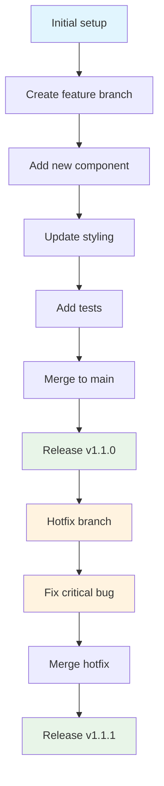

# Angular Micro-Frontend Template with Module Federation

A complete, production-ready Angular micro-frontend architecture template using Module Federation. Perfect for building scalable, distributed web applications.


## Table of Contents

- [Overview](#overview)
- [Quick Start](#quick-start)
- [Architecture](#architecture)
- [Project Structure](#project-structure)
- [How It Works](#how-it-works)
- [Development Guide](#development-guide)
- [Contributing](#contributing)
- [Security](#security)
- [Changelog](#changelog)
- [Configuration](#configuration)
- [Deployment](#deployment)
- [FAQ & Troubleshooting](#faq--troubleshooting)

## Overview

This template demonstrates a modern micro-frontend architecture where:

- **Shell Application** acts as the main container and orchestrator
- **Feature Applications** are independent micro-frontends that can be developed and deployed separately
- **Module Federation** enables runtime integration and code sharing

### Key Benefits

- **Independent Development** - Teams can work on different parts simultaneously
- **Independent Deployment** - Deploy micro-frontends separately
- **Technology Agnostic** - Mix different frameworks and versions
- **Scalable Architecture** - Add new micro-frontends easily
- **Code Sharing** - Share common libraries and components

## Architecture

### High-Level Architecture Diagram


### Component Interaction Flow


### Module Federation Architecture


## Quick Start

### Prerequisites

- Node.js 14.x or higher
- npm 6.x or higher
- Angular CLI 13+
- Git

### Automated Setup (Recommended)

```bash
# Clone the repository
git clone https://github.com/[your-username]/[your-repo-name].git
cd [your-repo-name]

# Run automated setup
chmod +x setup.sh
./setup.sh

# Install dependencies and start
npm run install:all
npm start
```

### Manual Setup

```bash
# 1. Clone and navigate
git clone https://github.com/[your-username]/[your-repo-name].git
cd [your-repo-name]

# 2. Install dependencies for both applications
cd shell-app && npm install && cd ..
cd feature1-app && npm install && cd ..

# 3. Start applications (requires 2 terminals)
# Terminal 1: Feature app
cd feature1-app && npm start

# Terminal 2: Shell app
cd shell-app && npm start
```

### Access Applications

- **Shell App**: http://localhost:4200
- **Feature App**: http://localhost:5000

### Available Scripts

- `npm start` - Start all applications in development mode
- `npm run build` - Build all applications for production
- `npm test` - Run tests for all applications
- `npm run lint` - Lint all applications
- `npm run setup` - Run the setup script to customize the project
- `npm run clean` - Clean all node_modules and build artifacts

### Next Steps

1. Open http://localhost:4200 in your browser
2. Navigate through the application to see the micro-frontend in action
3. Check the documentation sections below for detailed information
4. Customize the project using the setup script

## Project Structure

```
[your-repo-name]/
├── shell-app/                    # Main container application
│   ├── src/
│   │   ├── app/
│   │   │   ├── app-routing.module.ts    # Main routing with micro-frontend routes
│   │   │   ├── app.component.ts         # Shell application component
│   │   │   └── error-page/           # Error handling components
│   │   ├── environments/             # Environment configurations
│   │   └── main.ts                      # Application bootstrap
│   ├── webpack.config.js                # Module Federation configuration
│   ├── webpack.prod.config.js           # Production configuration
│   └── package.json                     # Dependencies and scripts
│
├── feature1-app/                 # Micro-frontend application
│   ├── src/
│   │   ├── app/
│   │   │   ├── mfe1/                 # Main feature module
│   │   │   ├── app.module.ts            # Feature app module
│   │   │   └── app-routing.module.ts    # Feature routing
│   │   ├── environments/             # Environment configurations
│   │   ├── bootstrap.ts                 # Module Federation bootstrap
│   │   └── main.ts                      # Dynamic import for MF
│   ├── webpack.config.js                # Module Federation configuration
│   ├── webpack.prod.config.js           # Production configuration
│   └── package.json                     # Dependencies and scripts
│
├── .github/                      # GitHub Actions & templates
│   ├── workflows/
│   │   └── ci.yml                       # Continuous Integration pipeline
│   ├── ISSUE_TEMPLATE/               # Issue templates
│   └── pull_request_template.md         # PR template
│
├── .vscode/                      # VS Code workspace configuration
│   └── angular-microfrontend-template.code-workspace
│
├── setup.sh                         # Automated setup script
├── README.md                        # This file
├── CONTRIBUTING.md                  # Contribution guidelines
├── CODE_OF_CONDUCT.md              # Code of conduct
└── LICENSE                          # MIT-0 License
```

## How It Works

### 1. Module Federation Configuration

#### Shell App (Consumer)

```javascript
// shell-app/webpack.config.js
const ModuleFederationPlugin = require("@angular-architects/module-federation/webpack");

module.exports = {
  plugins: [
    new ModuleFederationPlugin({
      remotes: {
        mfe1: "http://localhost:5000/remoteEntry.js",
      },
    }),
  ],
};
```

#### Feature App (Producer)

```javascript
// feature1-app/webpack.config.js
const ModuleFederationPlugin = require("@angular-architects/module-federation/webpack");

module.exports = {
  plugins: [
    new ModuleFederationPlugin({
      name: "mfe1",
      exposes: {
        "./Module": "./src/app/mfe1/mfe1.module.ts",
      },
    }),
  ],
};
```

### 2. Dynamic Loading Process


### 3. Startup Sequence


## Development Guide

### Available NPM Scripts

#### Root Level Scripts

```bash
npm run install:all      # Install dependencies for all apps
npm start               # Start both shell and feature apps
npm run build           # Build all applications
npm run build:prod      # Production build for all apps
npm test               # Run tests for all apps
npm run lint           # Lint all applications
npm run clean          # Clean all node_modules and build artifacts
```

#### Individual App Scripts

```bash
# Shell app
npm run start:shell     # Start shell app only
npm run build:shell     # Build shell app only
npm run test:shell      # Test shell app only

# Feature app
npm run start:feature   # Start feature app only
npm run build:feature   # Build feature app only
npm run test:feature    # Test feature app only
```

### Adding a New Micro-Frontend

1. **Create New Angular App**

```bash
ng new my-feature-app --routing --style=scss
cd my-feature-app
npm install @angular-architects/module-federation
```

2. **Configure Module Federation**

```bash
ng add @angular-architects/module-federation --project my-feature-app --type remote --port 5001
```

3. **Update Shell App Configuration**

```javascript
// shell-app/webpack.config.js
remotes: {
  "mfe1": "http://localhost:5000/remoteEntry.js",
  "myFeature": "http://localhost:5001/remoteEntry.js"  // Add this
}
```

4. **Add Routing in Shell App**

```typescript
// shell-app/src/app/app-routing.module.ts
{
  path: 'my-feature',
  loadChildren: () => loadRemoteModule({
    type: 'module',
    remoteEntry: 'http://localhost:5001/remoteEntry.js',
    exposedModule: './Module'
  }).then(m => m.MyFeatureModule)
}
```

### Development Workflow



**Recommended Git Flow:**

1. **Feature Development**

   ```bash
   git checkout -b feature/new-component
   # Make changes
   git commit -m "feat: add new component"
   git push origin feature/new-component
   # Create PR and merge
   ```

2. **Hotfix Process**
   ```bash
   git checkout -b hotfix/critical-fix
   # Fix the issue
   git commit -m "fix: resolve critical bug"
   git push origin hotfix/critical-fix
   # Create PR and merge
   ```

## Configuration

### Environment Configuration

#### Development Environment

```typescript
// shell-app/src/environments/environment.ts
export const environment = {
  production: false,
  mfe1Url: "http://localhost:5000/remoteEntry.js",
  apiUrl: "http://localhost:3000/api",
};
```

#### Production Environment

```typescript
// shell-app/src/environments/environment.prod.ts
export const environment = {
  production: true,
  mfe1Url: "https://feature1.yourdomain.com/remoteEntry.js",
  apiUrl: "https://api.yourdomain.com",
};
```

### Port Configuration

To change default ports, update the following files:

1. **Shell App Port** (default: 4200)

```javascript
// shell-app/webpack.config.js
devServer: {
  port: 4200, // Change this
}
```

2. **Feature App Port** (default: 5000)

```javascript
// feature1-app/webpack.config.js
devServer: {
  port: 5000, // Change this
}
```

3. **Update Remote URLs**

```javascript
// shell-app/webpack.config.js
remotes: {
  mfe1: "http://localhost:5000/remoteEntry.js", // Update port here
}
```

### Shared Dependencies

Configure shared dependencies to avoid duplication:

```javascript
// webpack.config.js (both apps)
const ModuleFederationPlugin = require("@angular-architects/module-federation/webpack");

module.exports = {
  plugins: [
    new ModuleFederationPlugin({
      shared: {
        "@angular/core": { singleton: true, strictVersion: true },
        "@angular/common": { singleton: true, strictVersion: true },
        "@angular/router": { singleton: true, strictVersion: true },
      },
    }),
  ],
};
```

## Deployment

### Build Commands

```bash
# Development build
npm run build

# Production build
npm run build:prod

# Individual app builds
npm run build:shell:prod
npm run build:feature:prod
```

### Deployment Options

#### 1. Static Hosting (Netlify, Vercel)

```bash
# Build applications
npm run build:prod

# Deploy shell app to main domain
# Deploy feature apps to subdomains or different paths
```

#### 2. Docker Deployment

Create a Dockerfile for each application:

```dockerfile
# Shell app Dockerfile
FROM node:16-alpine AS builder
WORKDIR /app
COPY package*.json ./
RUN npm ci
COPY . .
RUN npm run build:shell:prod

FROM nginx:alpine
COPY --from=builder /app/shell-app/dist /usr/share/nginx/html
COPY nginx.conf /etc/nginx/nginx.conf
EXPOSE 80
CMD ["nginx", "-g", "daemon off;"]
```

#### 3. Kubernetes Deployment

```yaml
# shell-app-deployment.yaml
apiVersion: apps/v1
kind: Deployment
metadata:
  name: shell-app
spec:
  replicas: 3
  selector:
    matchLabels:
      app: shell-app
  template:
    metadata:
      labels:
        app: shell-app
    spec:
      containers:
        - name: shell-app
          image: your-registry/shell-app:latest
          ports:
            - containerPort: 80
```

#### 4. Cloud Deployment

##### AWS S3 + CloudFront

```bash
# Build and deploy to S3
npm run build:prod
aws s3 sync shell-app/dist/ s3://your-shell-app-bucket --delete
aws s3 sync feature1-app/dist/ s3://your-feature1-app-bucket --delete
```

##### Azure Static Web Apps

```yaml
# .github/workflows/azure-static-web-apps.yml
name: Azure Static Web Apps CI/CD
on:
  push:
    branches: [main]
jobs:
  build_and_deploy_job:
    runs-on: ubuntu-latest
    steps:
      - uses: actions/checkout@v2
      - name: Build And Deploy
        uses: Azure/static-web-apps-deploy@v1
        with:
          azure_static_web_apps_api_token: ${{ secrets.AZURE_STATIC_WEB_APPS_API_TOKEN }}
          repo_token: ${{ secrets.GITHUB_TOKEN }}
          action: "upload"
          app_location: "shell-app/dist"
```

## FAQ & Troubleshooting

### Frequently Asked Questions

#### Q: What is Module Federation?

**A:** Module Federation is a Webpack feature that allows multiple separate builds to form a single application. It enables runtime integration of separately deployed applications.

#### Q: Can I use different Angular versions?

**A:** While possible, it's recommended to keep all micro-frontends on the same major Angular version for compatibility.

#### Q: How do I handle shared state?

**A:** Use shared services, browser storage, URL parameters, or state management libraries like NgRx.

#### Q: How do I handle authentication?

**A:** Implement shared authentication services or use token-based authentication with browser storage.

### Common Issues and Solutions

| Issue                    | Cause                   | Solution                                          |
| ------------------------ | ----------------------- | ------------------------------------------------- |
| **Module not found**     | Feature app not running | Start feature app first (`npm run start:feature`) |
| **CORS errors**          | Different origins       | Configure proper CORS headers in server           |
| **Loading chunk failed** | Network/URL issues      | Check network connectivity and remote URLs        |
| **Build failures**       | Version conflicts       | Ensure compatible Node.js/Angular versions        |
| **Port conflicts**       | Port already in use     | Change ports in webpack.config.js files           |
| **Styles conflicting**   | CSS leakage             | Use CSS modules or component encapsulation        |

### Debug Mode

```bash
# Enable verbose logging
npm run start:shell -- --verbose
npm run start:feature -- --verbose

# Check webpack bundle analysis
npm install --save-dev webpack-bundle-analyzer
npm run build:shell -- --stats-json
npx webpack-bundle-analyzer shell-app/dist/stats.json
```

### Performance Optimization

1. **Bundle Analysis**

```bash
npm run build:prod
npx webpack-bundle-analyzer shell-app/dist/stats.json
```

2. **Lazy Loading**

```typescript
// Implement lazy loading for routes
{
  path: 'feature',
  loadChildren: () => import('./feature/feature.module').then(m => m.FeatureModule)
}
```

3. **Preloading**

```html
<!-- Preload critical micro-frontends -->
<link rel="preload" href="http://localhost:5000/remoteEntry.js" as="script" />
```

## Customization

### Quick Customization with Setup Script

```bash
./setup.sh
```

The setup script will prompt for:

- Project name
- Author/organization name
- GitHub username
- Repository name

### Manual Customization Checklist

- [ ] Update `package.json` files with your project details
- [ ] Modify application names and descriptions
- [ ] Update environment configurations
- [ ] Configure remote URLs for your domains
- [ ] Update routing paths and component names
- [ ] Customize styling and branding
- [ ] Add your own features and components
- [ ] Configure deployment pipelines

### Styling and Branding

1. **Update Global Styles**

```scss
// shell-app/src/styles.scss
:root {
  --primary-color: #your-brand-color;
  --secondary-color: #your-secondary-color;
}
```

2. **Component Styling**

```scss
// Use consistent styling across micro-frontends
.app-shell {
  font-family: "Your-Font", sans-serif;
  color: var(--primary-color);
}
```

3. **Shared Design System**

```typescript
// Create shared component library
ng generate library shared-ui
ng build shared-ui
```

## Contributing

We love your input! We want to make contributing to this Angular micro-frontend template as easy and transparent as possible, whether it's:

- Reporting a bug
- Discussing the current state of the code
- Submitting a fix
- Proposing new features
- Becoming a maintainer

### Quick Start for Contributors

1. Fork the repository
2. Clone your fork: `git clone https://github.com/[your-username]/[your-repo-name].git`
3. Create a feature branch: `git checkout -b feature/amazing-feature`
4. Install dependencies: `npm run install:all`
5. Make your changes and test them: `npm start`
6. Commit your changes: `git commit -m 'Add some amazing feature'`
7. Push to the branch: `git push origin feature/amazing-feature`
8. Open a Pull Request

### Reporting Bugs

**Great Bug Reports** tend to have:

- A quick summary and/or background
- Steps to reproduce
  - Be specific!
  - Give sample code if you can
- What you expected would happen
- What actually happens
- Notes (possibly including why you think this might be happening, or stuff you tried that didn't work)

### Suggesting Features

We track feature requests as GitHub issues. When creating a feature request:

- **Use a clear and descriptive title**
- **Provide a detailed description** of the suggested feature
- **Explain why this feature would be useful** to most users
- **List some other projects where this feature exists** (if applicable)

### Pull Request Process

1. **Update the README.md** with details of changes if applicable
2. **Add tests** for any new functionality
3. **Ensure all tests pass**: `npm test`
4. **Update documentation** for any changed functionality
5. **Follow the coding standards** outlined below
6. **Squash commits** if you have multiple commits for a single feature

#### Pull Request Requirements

- [ ] Tests pass locally
- [ ] Code follows the style guidelines
- [ ] Self-review of code completed
- [ ] Documentation updated (if applicable)
- [ ] No merge conflicts

### Code Style Guidelines

#### TypeScript/Angular Standards

- Follow the [Angular Style Guide](https://angular.io/guide/styleguide)
- Use TypeScript strict mode
- Prefer `const` over `let`, avoid `var`
- Use meaningful variable and function names
- Add type annotations for all function parameters and return types

#### File Organization

- Keep components small and focused
- Use barrel exports (`index.ts`) for clean imports
- Group related files in feature folders
- Follow Angular's recommended folder structure

#### Naming Conventions

- **Files**: kebab-case (e.g., `my-component.ts`)
- **Classes**: PascalCase (e.g., `MyComponent`)
- **Variables/Functions**: camelCase (e.g., `myVariable`)
- **Constants**: SCREAMING_SNAKE_CASE (e.g., `MY_CONSTANT`)

#### Code Formatting

We use Prettier and ESLint. Before committing:

```bash
npm run lint
npm run format  # if available
```

### Testing Guidelines

- Write unit tests for all new components and services
- Aim for at least 80% code coverage
- Use meaningful test descriptions
- Mock external dependencies
- Test both success and error scenarios

#### Running Tests

```bash
# Run all tests
npm test

# Run tests with coverage
npm run test:coverage

# Run tests in watch mode
npm run test:watch
```

### Community Guidelines

#### Be Respectful

- Use welcoming and inclusive language
- Be respectful of differing viewpoints and experiences
- Gracefully accept constructive criticism
- Focus on what is best for the community

#### Be Collaborative

- Help others learn and grow
- Share knowledge and resources
- Provide constructive feedback
- Support fellow contributors

### What We're Looking For

We're particularly interested in contributions that:

- Improve documentation and examples
- Add support for more frameworks (React, Vue.js micro-frontends)
- Enhance the development experience
- Add more deployment options
- Improve performance and bundle size
- Add comprehensive testing examples

---

## 📄 License

This project is licensed under the MIT-0 License - see the [LICENSE](LICENSE) file for details.

---

**Happy coding! **

If you find this template helpful, please consider:

- Starring the repository
- Reporting bugs
- Suggesting new features
- Contributing to the project

**Need help?** Open an issue or start a discussion!

## Security

### Supported Versions

We provide security updates for the following versions:

| Version | Supported |
| ------- | --------- |
| 1.x.x   | Yes       |
| < 1.0   | No        |

### Reporting a Vulnerability

We take security seriously. If you discover a security vulnerability, please follow these steps:

#### Private Disclosure

**DO NOT** open a public GitHub issue for security vulnerabilities.

Instead, please report security vulnerabilities by:

1. **Email**: Send details to [your-email@domain.com] (replace with your email)
2. **Include**:
   - Description of the vulnerability
   - Steps to reproduce
   - Potential impact
   - Any suggested fixes (if you have them)

#### What to Include

- **Clear description** of the vulnerability
- **Steps to reproduce** the issue
- **Versions affected**
- **Potential impact** and severity
- **Any relevant logs** or screenshots
- **Your contact information** for follow-up

#### Response Timeline

- **Acknowledgment**: Within 24 hours
- **Initial assessment**: Within 72 hours
- **Resolution timeline**: Depends on severity and complexity

### Security Best Practices

When using this template, consider these security practices:

#### For Development

- **Keep dependencies updated**: Regularly run `npm audit` and update packages
- **Use environment variables**: Never commit sensitive data like API keys
- **Validate inputs**: Always validate data from remote sources
- **Use HTTPS**: Ensure all remote module federation URLs use HTTPS in production

#### For Deployment

- **Content Security Policy**: Configure proper CSP headers
- **CORS Configuration**: Set appropriate CORS policies for your micro-frontends
- **Authentication**: Implement proper authentication across all micro-frontends
- **Monitoring**: Set up security monitoring and logging

#### Module Federation Security

- **Trusted Sources**: Only load micro-frontends from trusted domains
- **Runtime Validation**: Validate loaded modules before execution
- **Error Boundaries**: Implement proper error handling to prevent crashes
- **Isolation**: Ensure proper isolation between micro-frontends

### Security Configuration Examples

#### Environment Variables (.env)

```bash
# Example - DO NOT commit real values
API_URL=https://api.yourdomain.com
MFE_REMOTE_URL=https://mfe.yourdomain.com
AUTH_SECRET=your-secret-key
```

#### Content Security Policy

```html
<meta
  http-equiv="Content-Security-Policy"
  content="default-src 'self'; 
               script-src 'self' https://trusted-domain.com; 
               style-src 'self' 'unsafe-inline';"
/>
```

#### CORS Configuration

```javascript
// Express.js example
app.use(
  cors({
    origin: ["https://yourdomain.com", "https://mfe.yourdomain.com"],
    credentials: true,
  })
);
```

## Changelog

All notable changes to this project will be documented in this file.

The format is based on [Keep a Changelog](https://keepachangelog.com/en/1.0.0/),
and this project adheres to [Semantic Versioning](https://semver.org/spec/v2.0.0.html).

### [Unreleased]

#### Added

- Initial project template release
- Complete GitHub repository setup

### [1.0.0] - 2024-07-16

#### Added

- **Shell Application**: Main container application with routing
- **Feature Application**: Example micro-frontend with Module Federation
- **Module Federation Setup**: Complete webpack configuration for runtime integration
- **Development Workflow**: NPM scripts for development, testing, and building
- **Documentation**: Comprehensive README with architecture diagrams
- **Setup Script**: Automated project customization script
- **GitHub Integration**:
  - CI/CD workflow with GitHub Actions
  - Issue templates for bugs, features, and questions
  - Pull request template
  - Security policy
  - Contributing guidelines
- **Environment Configuration**: Development and production environment files
- **Build System**: Production-ready build configurations
- **Testing Setup**: Unit test configurations for both applications
- **Linting**: ESLint and Prettier configurations
- **Git Configuration**: Comprehensive .gitignore file

#### Features

- **Modern Architecture**: Micro-frontend architecture using Module Federation
- **Production Ready**: Complete build and deployment configurations
- **Responsive Design**: Mobile-first responsive layouts
- **Developer Experience**: Hot reload, debugging tools, and development scripts
- **Documentation**: Extensive documentation with visual diagrams
- **Testing**: Unit testing setup with Karma and Jasmine
- **Code Quality**: ESLint, Prettier, and strict TypeScript configuration
- **Security**: Security policy and best practices documentation
- **Browser Support**: Support for modern browsers
- **Performance**: Optimized builds with code splitting and lazy loading

#### Technical Stack

- **Frontend**: Angular 13.3
- **Build Tool**: Webpack with Module Federation
- **Language**: TypeScript
- **Styling**: SCSS
- **Testing**: Karma, Jasmine
- **Linting**: ESLint, Prettier
- **CI/CD**: GitHub Actions

#### Project Structure

```
project/
├── shell-app/              # Main container application (port 4200)
├── feature1-app/           # Example micro-frontend (port 5000)
├── .github/                # GitHub workflows and templates
├── package.json            # Root package management
├── setup.sh                # Automated setup script
├── README.md               # Comprehensive documentation
├── CONTRIBUTING.md         # Contribution guidelines
├── SECURITY.md             # Security policy
├── CHANGELOG.md            # This file
└── LICENSE                 # MIT License
```

#### Getting Started

1. Clone the repository
2. Run `./setup.sh` to customize the project
3. Install dependencies: `npm run install:all`
4. Start development: `npm start`
5. Access applications:
   - Shell App: http://localhost:4200
   - Feature App: http://localhost:5000

#### Development Commands

- `npm start` - Start both applications
- `npm test` - Run all tests
- `npm run build` - Build all applications
- `npm run lint` - Run linting
- `npm run clean` - Clean all builds and dependencies

#### Deployment

The template supports multiple deployment strategies:

- Static hosting (Netlify, Vercel, GitHub Pages)
- Container deployment (Docker, Kubernetes)
- Cloud platforms (AWS, Azure, GCP)

#### Browser Support

- Chrome (latest)
- Firefox (latest)
- Safari (latest)
- Edge (latest)

### Release Notes Template

When creating new releases, use this template:

#### [Version] - YYYY-MM-DD

##### Added

- New features and functionality

##### Changed

- Changes to existing functionality

##### Deprecated

- Features that will be removed in future versions

##### Removed

- Features removed in this version

##### Fixed

- Bug fixes

##### Security

- Security improvements and fixes

---

## Support & Community

### Getting Help

If you encounter any issues or have questions:

- Check the documentation sections above
- Search existing issues on GitHub
- Create a new issue using the appropriate template
- Join our community discussions

### Acknowledgments

- Angular team for the amazing framework
- Webpack Module Federation for enabling micro-frontend architecture
- All contributors who make this project better

---

**Made with love for the Angular community**

If you find this template helpful, please consider:

- Starring the repository
- Reporting bugs
- Suggesting new features
- Contributing to the project

**Need help?** Open an issue or start a discussion!
